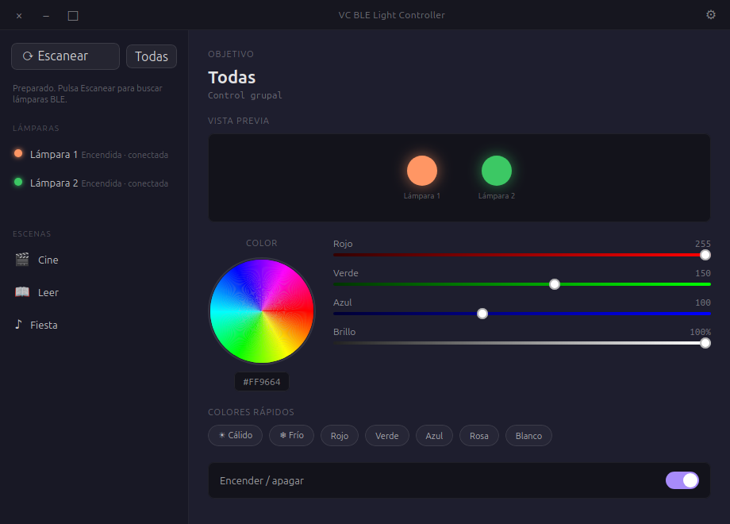

# VC BLE Light Controller

Unofficial desktop app for Ubuntu that detects and controls compatible
`VC-BLELIGHT` BLE lamps.

> **Not official:** VC BLE Light Controller is not affiliated with Raingel, the
> official Android app, or any lamp manufacturer. It is an independent community
> app for devices that expose the `VC-BLELIGHT` BLE protocol.

The app uses a borderless desktop window with custom controls for minimizing,
maximizing/restoring, closing, and opening settings.



## Install From APT

After the GitHub Pages apt repository is published, install with:

```bash
sudo install -d -m 0755 /usr/share/keyrings
curl -fsSL https://sergiormb.github.io/vc-ble-light-controller/vc-ble-light-controller-archive-keyring.gpg | \
  sudo tee /usr/share/keyrings/vc-ble-light-controller-archive-keyring.gpg >/dev/null
echo "deb [signed-by=/usr/share/keyrings/vc-ble-light-controller-archive-keyring.gpg] https://sergiormb.github.io/vc-ble-light-controller stable main" | \
  sudo tee /etc/apt/sources.list.d/vc-ble-light-controller.list
sudo apt update
sudo apt install vc-ble-light-controller
```

Run it from the Ubuntu launcher or with:

```bash
vc-ble-light-controller
```

## Manual Local Install

Build the `.deb` locally:

```bash
./scripts/build-deb.sh
```

Install the generated package:

```bash
sudo apt install ./dist/vc-ble-light-controller_0.1.0_all.deb
```

## Development

Requirements:

- Ubuntu with BlueZ.
- Python 3.11 or newer.
- GTK3 and WebKit2GTK 4.1.

Create a local environment:

```bash
./scripts/setup.sh
```

If Ubuntu does not have Python venv support installed:

```bash
sudo apt install python3.14-venv
```

Fallback without using venv:

```bash
./scripts/setup-user.sh
```

Run from the checkout:

```bash
./scripts/run.sh
```

## Usage

1. Press `Escanear`.
2. Select a detected lamp or `Todas`.
3. Change power, color, brightness, or apply a scene.

If the app warns that Bluetooth is not in BLE mode, open `Configuración` from
the gear icon and use `Aplicar modo BLE`. Ubuntu will ask for authorization via
`pkexec`; the app sets `ControllerMode = le` in `/etc/bluetooth/main.conf` and
restarts Bluetooth.

Configuration is stored in:

```text
~/.config/vc-ble-light-controller/lights.json
```

For compatibility, old settings from `~/.config/raingel/lights.json` are read
and migrated on first launch.

## Screenshot

Regenerate the README screenshot with:

```bash
./scripts/capture-screenshot.py docs/screenshot.png
```

## BLE Protocol

VC BLE Light Controller uses the protocol documented by
`AndrianBdn/open-vc-blelight`:

- Write characteristic: `0000AE01-0000-1000-8000-00805f9b34fb`.
- Power on: `01 01`.
- Power off: `01 00`.
- Brightness: `02 level`.
- RGB color: `03 r g b`.

## Tests

```bash
python3 -m pytest
python3 -m compileall -q src tests
```

## Troubleshooting Bluetooth

If lamps are detected but power/color commands fail with:

```text
[org.bluez.Error.BREDR.ProfileUnavailable] No more profiles to connect to
```

BlueZ is trying a classic BR/EDR profile instead of forcing BLE. Use
`Configuración` > `Aplicar modo BLE`, or manually set:

```ini
ControllerMode = le
```

in `/etc/bluetooth/main.conf`, then restart Bluetooth:

```bash
sudo systemctl restart bluetooth
```
